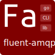

# Fluent AMQP




[](https://hub.docker.com/r/reddec/fluent-amqp/)
[](https://hub.docker.com/r/reddec/fluent-amqp-telegram-sender/)
[](https://build.snapcraft.io/user/reddec/fluent-amqp)
[](http://reddec.net/about/#donate)
[](https://godoc.org/github.com/reddec/fluent-amqp)
[](https://bintray.com/reddec/debian/fluent-amqp/_latestVersion)


Library that provides fluent and easy wrapper over [streadway-amqp](https://github.com/streadway/amqp) API.
Adds such features like:

- Reconnectiong. Will restore all defined infrastructure
- Non-blocking processing of messages
- Optional auto-requeue (with delay)
- Signing and verifiying messages by public/private pair

[API documentation](https://godoc.org/github.com/reddec/fluent-amqp)

## Signing and verification

Hash algorithm (x509) SHA512 with RSA, sign - SHA512.

The signer (producer) should use private key to sign content of message body and message id.

The validator (consumer) should use public certificate to validate content of message and message id against signature and should drops invalid or duplicated messages.

The sign should be put to a header (`X-Signature` by default: see `DefaultSignatureHeader` constant in godoc) as __binary__ object (**not hex or base64 encoded**).

```
DATA = BYTES(ID) ... BYTES(BODY)
# SIGN via PKCS#1 v1.5
SIGN_HEADER_BODY = SIGN_SHA512(PRIVATE_KEY, DATA)
```


## States


## Default message

Message by default has:

* Delivery type - persistent
* Time - current time in UTC


## Templates


`amqp-recv` supports templating output `-o template`. Template content read from STDIN.

Root template object is a [amqp.Delivery](https://github.com/streadway/amqp/blob/dcfad599551a8042d2e1971a496f31624a7f4738/delivery.go#L28) with functions
from [Sprig](http://masterminds.github.io/sprig/) plus additional methods like:

* `asText` - converts bytes to string


1. Basic example:


Print same as `-o plain`.

```
echo '{{- .Body | asText -}}' | amqp-recv -o template ...
```

2. Notification to telegram

Use combination of basic CLI utils and templates.

```bash
TOKEN="xxxyyyy"        # BotFather token for Telegram (see here: https://t.me/BotFather)
CHAT_ID="1234567"      # Target Telegram chat ID (find yours: https://t.me/MyTelegramID_bot)
QUEUE="notification"   # queue name should be defined if persistent required
EXCHANGE="amqp.topic"  # source of notification
TYPE="topic"           # exchange type
TOPIC="#"              # specify subject that will be sent over telegram (# - everything)

while true; do
  echo -n -e 'Subject: {{.RoutingKey}}\n\n{{.Body | asText}}' | amqp-recv -o template -Q $QUEUE -e $EXCHANGE -k $TYPE "$TOPIC" > message.txt
  curl -f -X POST --data "text=$(cat message.txt)" --data "chat_id=${CHAT_ID}" "https://api.telegram.org/bot${TOKEN}/sendMessage" || exit 1
done
```


## Command line utilities

* [amqp-exec](cmd/amqp-exec) - CGI like daemon to listen message and run executable (and send reply)
* [amqp-recv](cmd/amqp-recv) - Receive message from AMQP (like `cat` command)
* [amqp-send](cmd/amqp-send) - Send message to AMQP (like `wall` command)

### Installation

[](https://snapcraft.io/fluent-amqp)

* [snapcraft: fluent-amqp](https://snapcraft.io/fluent-amqp)

  after installation commands are available with `fluent-amqp.` prefixes (i.e. `fluent-amqp.amqp-exec`)
* [pre-build binaries](https://github.com/reddec/fluent-amqp/releases) for all major platform

* From bintray repository for most **debian**-based distribution (`trusty`, `xenial`, `bionic`, `buster`, `wheezy`):
```bash
sudo apt-key adv --keyserver hkp://keyserver.ubuntu.com:80 --recv-keys 379CE192D401AB61
echo "deb https://dl.bintray.com/reddec/debian {distribution} main" | sudo tee -a /etc/apt/sources.list
sudo apt install amqp-send amqp-exec amqp-recv
```